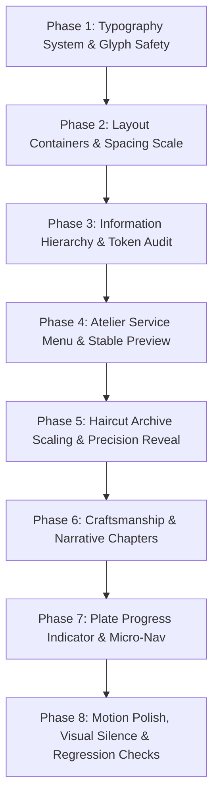

# Luxury Editorial Barber Web — System Refinement & Architecture Design

> **Core Philosophy**: *"Do not add visual complexity to compensate for weak hierarchy. First make the typography, spacing, scale and narrative work without animation. Then use motion only to amplify what already works."*

---

## 1. Executive Summary & Art Direction Guardrails

### 1.1 Goal
Refine and elevate the existing `barber-web` application into a world-class **Digital Barber Editorial & Haircut Archive**. This is an evolutionary refinement of an already strong visual identity, eliminating typography collision bugs, establishing intentional visual silence and pacing, scaling up haircut artwork presence, transforming services into a quiet luxury atelier menu, and grounding the digital presence in authentic barber craftsmanship.

### 1.2 Non-Negotiable Art Direction Guardrails
* **Color Palette**: Near-black background (`#0B0B0A`), warm dark surface (`#141413`), off-white / cream text (`#F4F0E8`), muted warm cream (`#A7A39B`), restrained gold accent (`#C7A66A` / `#6E5A37`).
* **Gold Accent Rule**: Gold is strictly semantic — reserved for primary CTAs, active plate indicators, prices, and focused interaction states. Gold is never sprayed as arbitrary decoration.
* **Plate Identity**: `01 / 07`, `PLATE 02`, `ARCHIVE.03` acts as the persistent editorial and navigational signature across the entire website.
* **Visual Silence**: Pacing alternates between high-impact editorial statements, generous breathing room (whitespace), and focused technical details.
* **One Dominant Visual Per Viewport**: Every viewport state has a single clear hierarchy winner (Hero = Headline; Archive = Haircut Artwork; Atelier = Active Service Row; Craft = Craftsmanship Photography; Booking = Primary Action).

---

## 2. Typography System & Anti-Overlap Engineering

### 2.1 Principle
Prevent text collision across supported breakpoints (320px to 1920px+) and font rendering conditions through tokenized line-height, intrinsic sizing, overflow-safe containers, and visual regression checks. **No padding/margin workarounds are permitted to mask line box errors.** Typography must be structurally sound at the font metrics, line-height, and container level.

### 2.2 Typography Scale & Tokens

| Token | Semantic Role | Font Family | Size Formula | Line-Height Formula | Letter Spacing |
| :--- | :--- | :--- | :--- | :--- | :--- |
| `Display XL` | Hero Headline | `Be Vietnam Pro` (900 Black) | `clamp(2.75rem, 8.5vw, 7.5rem)` | `clamp(0.92, 1vw + 0.88, 1.02)` | `-0.03em` to `-0.04em` |
| `Display Large` | Major Section Headings | `Be Vietnam Pro` (900 Black) | `clamp(2.25rem, 6vw, 5.25rem)` | `clamp(0.96, 0.8vw + 0.92, 1.05)` | `-0.025em` |
| `Heading` | Card / Section Item Titles | `Be Vietnam Pro` (800 Bold) | `clamp(1.25rem, 2.5vw, 2.25rem)` | `1.12` to `1.2` | `-0.01em` |
| `Body Editorial` | Editorial Descriptions | `Be Vietnam Pro` (300/400 Light) | `clamp(0.9375rem, 1.1vw, 1.125rem)` | `1.55` to `1.65` | `normal` |
| `Plate / Mono` | Technical Numbers & Timestamps | `JetBrains Mono` (700 Bold) | `clamp(0.6875rem, 0.8vw, 0.8125rem)` | `1.2` to `1.35` | `0.2em` to `0.28em` |
| `Price / Label` | Service Pricing & Sub-labels | `Be Vietnam Pro` (700/800 Bold) | `clamp(1.125rem, 1.8vw, 1.75rem)` | `1.1` | `normal` / `0.05em` |

### 2.3 Vietnamese Diacritics Safety Rules
* Explicitly allocate vertical line box space for uppercase Vietnamese tone marks (`Đ, Ế, Ắ, Ộ, Ử, Ỗ`).
* Disallow `overflow: hidden` on text wrappers where descenders (`y, g, p, q`) or accented ascenders are clipped during entrance animations.
* Responsive line-wrapping: Titles wrap naturally without hardcoded `<br>` tags that break on intermediate mobile/tablet widths.

---

## 3. Section-by-Section Architecture

### Section 00 — Hero (`#hero`)
* **Visual Dominance**: Condensed Hero Headline (`ĐỊNH HÌNH PHONG CÁCH. KHẲNG ĐỊNH BẢN SẮC.`).
* **Hierarchy Flow**:
  1. Micro Label: `00 / TIỆM BARBER CÁ NHÂN CAO CẤP` (Mono Gold)
  2. Dominant Headline (Display XL)
  3. Small editorial supporting statement (Body Editorial)
  4. Single Primary CTA `[ ĐẶT LỊCH HẸN 1-ON-1 ]` + Secondary link `[ XEM KIỂU TÓC ↓ ]`
  5. Minimal metadata footer row (City, Opening Hours, Established Year) separated by hairline borders.

### Section 01 — Haircut Archive (`#styles`)
* **UX Mode**: *Scroll as discovery* (No category tabs, no filter buttons, no dropdowns, no pagination).
* **Artwork Presence**: Increased visual dominance relative to existing layout. Responsive card width: `clamp(320px, 84vw, 980px)` with aspect-ratio `4/3` (mobile) to `3/2` (desktop) to give vertical haircut illustrations breathing space without visual dilution.
* **Plate Identity**: `01 / 07` plate watermark and label.
* **Subtle 4-Phase Scroll Reveal**:
  1. Card background & frame fade in (`opacity 0 -> 1`)
  2. Line drawing strokes progressively reveal
  3. Haircut title moves upward (`translateY(12px) -> 0`)
  4. Editorial description and metadata settle softly.

### Section 02 — Atelier Service Menu (`#services`)
* **UX Mode**: *Luxury Atelier Menu* on dark ground (`#0B0B0A`) with hairline horizontal dividers.
* **Layout**:
  ```text
  01  CẮT TÓC THIẾT KẾ                                  250K
      Tư vấn phom đầu · Cắt tạo hình · Sấy vuốt · 45 MIN
  ────────────────────────────────────────────────────────
  02  FADE CHUYÊN SÂU & RÂU                             350K
      Skin fade sắc nét · Cạo chấn khăn nóng · 60 MIN
  ────────────────────────────────────────────────────────
  03  TEXTURE & UỐN ĐỊNH HÌNH                           500K
      Uốn phồng chuẩn form · Dưỡng phục hồi · 90 MIN
  ────────────────────────────────────────────────────────

                        [ ĐẶT LỊCH HẸN ]
  ```
* **Desktop Interaction**: Hovering an atelier row activates an **anchored, stable floating image preview** within the menu container (not glued to cursor, preventing distraction and jitter).
* **Mobile Interaction**: Clean inline presentation; tapping gently expands service details without gating information behind modals.
* **Booking CTA**: **A single, decisive primary CTA at the bottom of the menu**. (One CTA = One Decision).

### Section 03 — The Experience / Visual Silence (`#experience`)
* **Pacing**: A cinematic breathing moment after the service menu.
* **Content**: Large typographic statement (`HƠN CẢ MỘT LẦN CẮT TÓC.`) with generous negative space, minimal supporting copy, and quiet plate numbering (`03 / 07`).

### Section 04 — Craftsmanship & Space (`#craft`)
* **Storytelling Structure**: Three distinct chapters blending architectural schematics with authentic craftsmanship imagery:
  * `01 // KHÔNG GIAN`: Studio privacy, acoustic calm, dedicated lighting.
  * `02 // TAY NGHỀ`: Precision scissors, magnetic clippers, sectioning techniques.
  * `03 // CHI TIẾT`: Hot herbal towel ritual, razor work, tailored finishing.
* **Content Integrity**: Focus on tangible craftsmanship qualities rather than unverified brand claims.

### Section 05 — Proof & Transformation (`#proof`)
* Real client results, interactive Before & After slider showcase with refined typography labels, and authentic client reflections.

### Section 06 — Studio Location & Philosophy (`#location`)
* Studio address, hotline, operating schedule, and stylized minimal location plate.

### Section 07 — Final Booking Hero (`#contact`)
* Second visual climax: `SẴN SÀNG CHO MỘT DIỆN MẠO MỚI?`
* High-contrast gold primary CTA button `[ ĐẶT LỊCH HẸN NGAY ]` + direct phone and instant messaging channels.

---

## 4. Navigation & Plate Orientation System

### 4.1 Primary Fixed Minimal Bar
* Floating unobtrusive top bar with brand mark, minimal section anchor links, and quick booking pill.

### 4.2 Plate Scroll Progress Indicator
* **Desktop**: Minimal vertical rail indicating active narrative plate (`01 INTRO`, `02 CUTS`, `03 SERVICES`, `04 CRAFT`, `05 PROOF`, `06 LOCATION`, `07 BOOK`) updating dynamically on scroll without cluttering content.
* **Mobile**: Minimalist compact plate indicator (e.g. `03 / 07`) fixed at the screen edge to preserve mobile screen real estate.

---

## 5. Implementation Phasing Strategy



1. **Phase 1 — Typography**: Tokenize `Display XL`, `Display Large`, `Heading`, `Body`, `Plate/Mono`. Fix all line-height clamps and Vietnamese diacritics clearance.
2. **Phase 2 — Layout & Spacing**: Standardize container system (`max-width: 1400px`), eliminate arbitrary margins, scale haircut card viewports.
3. **Phase 3 — Information Hierarchy**: Realign text opacities, weights, and plate tags.
4. **Phase 4 — Atelier Menu**: Construct the dark luxury service rows with single footer CTA and anchored desktop preview.
5. **Phase 5 — Haircut Archive**: Refine continuous scroll layout, scale up artwork cards, implement 4-phase sequential entrance.
6. **Phase 6 — Narrative & Craftsmanship**: Polish 3-chapter craftsmanship section and visual silence transitions.
7. **Phase 7 — Navigation**: Implement desktop rail & mobile minimal plate progress indicator.
8. **Phase 8 — Polish & Validation**: Multi-viewport visual verification (375px, 390px, 430px, 768px, 1280px, 1440px, 1920px), reduced motion checks, build validation.

---

## 6. Verification & Acceptance Criteria
* **Zero Typography Collision**: No ascender/descender collision, no glyph clipping across any viewport.
* **Visual Hierarchy**: Exactly one dominant visual per viewport.
* **Mobile UX**: Flawless wrapping and touch interactions without cumbersome multi-tap requirements.
* **Build & Performance**: Clean TypeScript build, zero console errors, 60fps scroll performance.
