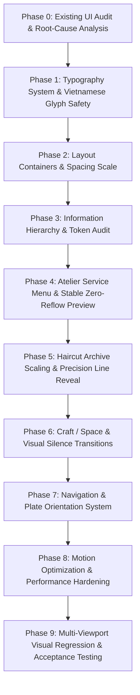

# Luxury Editorial Barber Web — System Refinement & Architecture Design

> **Core Philosophy / Design Principle #1**: *"Do not add visual complexity to compensate for weak hierarchy. First make the typography, spacing, scale and narrative work without animation. Then use motion only to amplify what already works."*

---

## 1. Executive Summary & Art Direction Guardrails

### 1.1 Goal
Refine and elevate the existing `barber-web` application into a world-class **Digital Barber Editorial & Haircut Archive**. This is an evolutionary refinement of an already strong visual identity: eliminating typography collision bugs, establishing intentional visual silence and pacing, scaling up haircut artwork presence, transforming services into a quiet luxury atelier menu, and grounding the digital presence in authentic barber craftsmanship.

### 1.2 Non-Negotiable Art Direction Guardrails
* **Color Palette**: Near-black background (`#0B0B0A`), warm dark surface (`#141413`), off-white / cream text (`#F4F0E8`), muted warm cream (`#A7A39B`), restrained gold accent (`#C7A66A` / `#6E5A37`).
* **Gold Accent Rule**: Gold is strictly semantic — reserved for primary CTAs, active plate indicators, prices, and focused interaction states. Gold is never sprayed as arbitrary decoration.
* **Plate Identity**: `01 / 07`, `PLATE 02`, `ARCHIVE.03` acts as the persistent editorial and navigational signature across the entire website.
* **Visual Silence**: Pacing alternates between high-impact editorial statements, generous breathing room (whitespace), and focused technical details.
* **One Dominant Visual Per Viewport**: Every viewport state has a single clear hierarchy winner:
  * Hero $\rightarrow$ Dominant Headline
  * Archive $\rightarrow$ Haircut Artwork
  * Atelier Menu $\rightarrow$ Active Service Row
  * Craft / Space $\rightarrow$ Craftsmanship Photography
  * Booking $\rightarrow$ Final Primary Action

---

## 2. Typography System & Anti-Overlap Engineering

### 2.1 Engineering Rule: Zero Compensating Hacks
Every typography and layout change must be traceable to an identified root cause rather than compensating CSS. **No `margin-top` / `padding-bottom` workarounds are permitted to mask line box errors.** Typography must be structurally sound at the font metrics, line-height, width constraint, and layout level.

### 2.2 Typography Scale & Tokens

| Token | Semantic Role | Font Family | Size Formula | Line-Height Range & Rule | Letter Spacing |
| :--- | :--- | :--- | :--- | :--- | :--- |
| `Display XL` | Hero Headline | `Be Vietnam Pro` (900 Black) | `clamp(2.75rem, 8.5vw, 7.5rem)` | `clamp(0.92, 1vw + 0.88, 1.02)` *(Sub-1 line-height allowed only if collision-free at all breakpoints)* | `-0.03em` to `-0.04em` |
| `Display Large` | Major Section Headings | `Be Vietnam Pro` (900 Black) | `clamp(2.25rem, 6vw, 5.25rem)` | `clamp(0.96, 0.8vw + 0.92, 1.05)` | `-0.025em` |
| `Heading` | Card / Section Item Titles | `Be Vietnam Pro` (800 Bold) | `clamp(1.25rem, 2.5vw, 2.25rem)` | `1.12` to `1.20` | `-0.01em` |
| `Body Editorial` | Editorial Descriptions | `Be Vietnam Pro` (300/400 Light) | `clamp(0.9375rem, 1.1vw, 1.125rem)` | `1.55` to `1.65` | `normal` |
| `Plate / Mono` | Technical Numbers & Timestamps | `JetBrains Mono` (700 Bold) | `clamp(0.6875rem, 0.8vw, 0.8125rem)` | `1.20` to `1.35` | `0.2em` to `0.28em` |
| `Price / Label` | Service Pricing & Sub-labels | `Be Vietnam Pro` (700/800 Bold) | `clamp(1.125rem, 1.8vw, 1.75rem)` | `1.10` | `normal` / `0.05em` |

### 2.3 Vietnamese Diacritics Safety & Mandatory Test Strings
Display typography and headlines must be explicitly tested against complex uppercase Vietnamese tone marks (`Đ, Ế, Ắ, Ộ, Ử, Ỗ, Ậ, Ẵ`):
* `ĐỊNH HÌNH PHONG CÁCH`
* `KHẲNG ĐỊNH BẢN SẮC`
* `TẠO KIỂU TRAU CHUỐT`
* `HƠN CẢ MỘT LẦN CẮT TÓC`
* `CẮT TÓC THIẾT KẾ & TỈA LAYER`
* `FADE CHUYÊN SÂU & RÂU`

### 2.4 Animation Clipping Protection
**Do not use `overflow: hidden` on the typography element itself for reveal animations.**
Use a dedicated parent wrapper whose vertical bounds are intentionally larger than the rendered glyph box:
```text
wrapper (clipping bounds with top/bottom glyph clearance)
  └── typography element (transform: translateY(...) -> 0)
```

---

## 3. Section-by-Section Architecture

```text
00 — HERO
│   ├── Brand Micro Label (00 / TIỆM BARBER CÁ NHÂN CAO CẤP)
│   ├── Dominant Headline (Display XL, collision-free)
│   ├── Supporting Copy (Body Editorial)
│   └── Primary Booking CTA + Subtle Section Anchor
│
01 — HAIRCUT ARCHIVE (SCROLL AS DISCOVERY)
│   ├── Increased Visual Presence (clamp(320px, 84vw, 980px), aspect 4/3 -> 3/2)
│   ├── Height & Contain Safe-Areas (no ultra-tall viewport blowout)
│   ├── Plate 01 / 07 Header & Hairline
│   └── 4-Phase Sequential Reveal (frame -> line drawing -> title -> metadata)
│
02 — ATELIER SERVICE MENU
│   ├── Luxury Dark Atelier Rows (#0B0B0A + Hairline Dividers)
│   ├── Plate Number · Service Name · Specs/Duration · Gold Price
│   ├── Anchored Stable Image Preview (Zero-reflow, no cursor attachment)
│   ├── Mobile Inline Expansion (No gated interaction)
│   └── Single Primary Booking CTA at Menu Bottom (One CTA = One Decision)
│
03 — THE EXPERIENCE (VISUAL SILENCE)
│   ├── Typographic Statement (HƠN CẢ MỘT LẦN CẮT TÓC)
│   └── Generous Negative Space Breathing Room
│
04 — CRAFT / SPACE
│   ├── Chapter 01: KHÔNG GIAN (Studio privacy, dedicated acoustics & lighting)
│   ├── Chapter 02: TAY NGHỀ (Scissors, magnetic clippers, sectioning techniques)
│   └── Chapter 03: CHI TIẾT (Hot herbal towel ritual, razor work, finishing)
│
05 — PROOF & TRANSFORMATION
│   ├── Editorial Client Transformation Showcase
│   ├── Optional Interactive Before/After Layer (Preserves editorial layout)
│   └── Authentic Client Reflections
│
06 — PHILOSOPHY & LOCATION
│   └── Minimalist Studio Coordinates, Schedule & Direct Contact Plate
│
07 — FINAL BOOKING HERO
    ├── Climax Statement (SẴN SÀNG CHO MỘT DIỆN MẠO MỚI?)
    └── High-Contrast Gold Booking Button + Direct Channels
```

---

## 4. Interaction & Navigation System

### 4.1 Navigation Hierarchy
* **Desktop**:
  * Top Bar: `Brand` on left, `Book` pill on right.
  * Side Rail: Plate orientation list (`01 INTRO`, `02 CUTS`, `03 SERVICES`, `04 CRAFT`, `05 PROOF`, `06 LOCATION`, `07 BOOK`) highlighting active section dynamically.
* **Mobile**:
  * Clean minimal header: `Brand` and compact indicator `03 / 07`.
  * Full section anchors are collapsed to eliminate screen crowding.

### 4.2 Interaction Rules
* **Interaction Enhances, Never Gates**: All essential information (prices, descriptions, hours, contact) is readable without requiring hover or tap.
* **Zero Reflow**: Hovering service rows activates an anchored overlay container within the menu geometry without shifting or jumping surrounding layout elements.

---

## 5. Performance Budget & Motion Engineering

* **Hardware-Accelerated Properties**: Only animate `transform` and `opacity`. Avoid animating width, height, margin, or layout-triggering properties.
* **Scroll Drivers**: Use `IntersectionObserver` or performant scroll progress bindings rather than unthrottled continuous window listeners.
* **Asset Loading**: All service preview images and below-the-fold media must be lazy-loaded.
* **Reduced Motion**: Full support for `prefers-reduced-motion: reduce` (instantly renders final states, disables continuous tickers and parallax).
* **Layout Shift Budget**: Cumulative Layout Shift (CLS) = 0.

---

## 6. Implementation Phasing Strategy



* **Phase 0 — Existing UI Audit**: Inspect all existing components, font loading, Tailwind theme tokens, line-height declarations, and log exact root causes of collisions.
* **Phase 1 — Typography**: Establish 5-level token scale, implement safe line-height formulas, and verify Vietnamese glyph collision clearance.
* **Phase 2 — Containers & Spacing**: Standardize page containers (`max-width: 1400px`), eliminate arbitrary margins, configure haircut card viewport scale.
* **Phase 3 — Information Hierarchy**: Rebalance text opacities, weights, and Plate semantics (`JetBrains Mono` strictly for technical metadata).
* **Phase 4 — Atelier Menu**: Build dark luxury service rows with stable anchored preview, mobile inline expansion, and single footer CTA.
* **Phase 5 — Haircut Archive**: Refine continuous scroll discovery, implement 4-phase sequential reveal with dedicated overflow-safe animation wrappers.
* **Phase 6 — Craft & Experience**: Polish 3-chapter craftsmanship narrative (`01 SPACE`, `02 CRAFT`, `03 DETAIL`) and visual silence breathing moments.
* **Phase 7 — Navigation**: Implement desktop rail and mobile compact plate progress indicator.
* **Phase 8 — Performance & Motion**: Enforce GPU-only transforms, layout-shift elimination, and `prefers-reduced-motion` compliance.
* **Phase 9 — Multi-Viewport Regression Testing**: Validate layout and typography across all target viewports.

---

## 7. Acceptance Criteria & Validation Gates

1. **A. Zero Typography Collision**: No ascender/descender collision, no glyph clipping across any viewport on all test strings (`ĐỊNH HÌNH PHONG CÁCH`, `KHẲNG ĐỊNH BẢN SẮC`, `CẮT TÓC THIẾT KẾ`, `FADE CHUYÊN SÂU`).
2. **B. No Layout Shift (CLS = 0)**: Hovering service rows, scrolling, and revealing cards must not shift surrounding layout.
3. **C. No Interaction Dependency**: Essential service descriptions, prices, and specs remain 100% accessible without hover or tap.
4. **D. Reduced Motion Compliance**: All animations gracefully fall back to clean static states when `prefers-reduced-motion` is enabled.
5. **E. Responsive Validation Gate**: Visually verified and collision-free at:
   * **Mobile**: `375 × 812`, `390 × 844`, `430 × 932`
   * **Tablet**: `768 × 1024`
   * **Desktop**: `1280 × 800`, `1440 × 900`, `1920 × 1080`
6. **F. Production Build**: Zero TypeScript errors, zero console warnings on production build (`pnpm build`).
